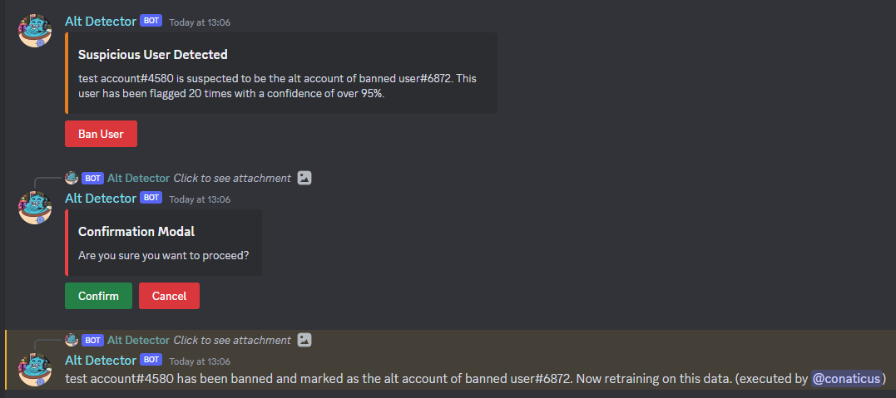

# Alt Detection (powered by AI)

## Introduction

This is the source code for a Discord Bot that can detect all accounts using [natural language processing](https://en.wikipedia.org/wiki/Natural_language_processing). The bot will automatically train on chat messages and flag suspected users based on the settings provided.

## Warning

This bot will likely produce a lot of false positives so please use with caution. I am not knowledgable of AI and this was simply a side project as proof of concept :)



## Configuration & Setup

1. Ensure that the latest version of [NodeJS](https://nodejs.org/en) installed.
2. Copy the `.env.example` & enter in the neccesary data.
3. Remove the comments from the `.env` to ensure it is parsed correctly (optional)
4. Run `npm install`
5. Run `npm run dev`

## Optimise Training Accuracy

If you have multiple users in your ban list that are alt accounts, I recommend that you specfiy this in the `bans.json`. If you do not see one of these, you need to first run `npm run dev` and stop the program so that it generates one.

Here is an example of how to define alt accounts. In this file is a list of banned users. `Alt#0001` and `Alt#0002` are both alt accounts belonging to `User#0001`, and `User#0002` is an individual account. The generated JSON will look like this:

```json
{
    "Alt#0001": [],
    "Alt#0002": [],
    "User#0001": [],
    "User#0002": []
}
```

In order to specify alts, you can group them to a singular account like so:

```json
{
    "User#0001": ["Alt#0001", "Alt#0002"],
    "User#0002": []
}
```

Ensure that you also remove them from the ban list to prevent any unexpected behaviour.

## Limitations

-   Does not use account age as a factor
-   Can only train on one channel
-   Using the basic [NLP.js](https://github.com/axa-group/nlp.js/) library (inaccuracies)
